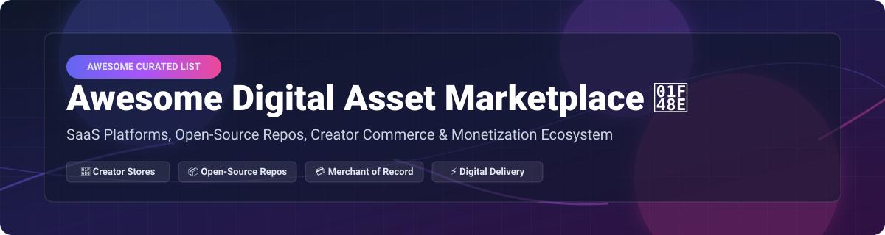

  

# Awesome Digital Asset Marketplace 💎

  
  
  
  
  

> 🚀 **Curated List of SaaS Platforms & Open-Source GitHub Projects for Selling Digital Products, Creator Monetization & Automated File Delivery**

---

## 📌 Overview & SEO Keywords

Welcome to the ultimate directory of **Digital Asset Marketplaces**, **Creator Commerce Infrastructure**, and **Self-Hosted E-Commerce Repositories**. Whether you are selling eBooks, SaaS subscriptions, game assets, developer templates, code licenses, or online courses, this guide covers both hosted **Merchant of Record (MoR)** platforms and top-rated **Open-Source alternatives**.

---

## 📊 Market Dynamics & Industry Insights

> 💡 **Market Size**: The global digital asset management & creator commerce market was valued at **~$6.5 Billion** and is projected to reach **~$18.2 Billion** by 2030 (CAGR of ~16.5%).  
> 🧩 **Market Fragmentation**: The market is **moderately to highly fragmented**. While platforms like Shopify and Gumroad hold significant mindshare in storefronts and general downloads, niche MoR vendors (Lemon Squeezy, Paddle, Polar) and self-hosted developer tools (Medusa, Saleor, Honorbox) prevent a single "winner-take-all" outcome. Creators and SaaS builders select stacks based on tax compliance, fee structures, and data sovereignty.

---

## 📑 Table of Contents
- [🛒 SaaS / Hosted Platforms](#-saas--hosted-platforms)
- [📦 Open-Source GitHub Projects](#-open-source-github-projects)
- [🤝 How to Contribute](#-how-to-contribute)
- [💖 Support & Sponsorship](#-support--sponsorship)
- [⚖️ Disclaimer](#-disclaimer)
- [📈 Star History](#-star-history)

---

## 🛒 SaaS / Hosted Platforms

Below is a comparative breakdown of leading commercial digital product platforms and Merchants of Record (MoR), sorted by company scale (valuation / annual revenue estimate descending).

| Platform 🏢 | Valuation / Revenue Scale 💰 | Pricing (Starting Tier) 🏷️ | Free Tier / Trial Limit 🎁 | Description & Core Features ⚡ |
| :--- | :--- | :--- | :--- | :--- |
| **[Shopify Digital Downloads](https://www.shopify.com/)** | **~$100 Billion Valuation** ($7.0B+ Revenue) | **$29/month** (Basic Plan + payment processing fees) | **3-day free trial**, then **$1/month for 1st month** | World's leading e-commerce engine with native digital delivery apps, global payment gateways, and scalable storefronts. |
| **[Creative Market](https://creativemarket.com/)** | **~$100 Million+ Valuation** (Acquired / High Scale) | **Free listing** (50% commission per sale on standard vendor accounts) | **Free Vendor Account** (No monthly fee; 50% revenue share per sale) | Curated marketplace dedicated to design assets, vectors, fonts, 3D models, and web templates. |
| **[Itch.io](https://itch.io/)** | **~$50 Million - $100 Million Valuation** | **0% + flexible revenue share** (Open revenue sharing model) | **Free unlimited store** (Set your own revenue split down to 0%) | Leading creator-first marketplace for indie games, game assets, developer tools, and digital zines. |
| **[Podia](https://www.podia.com/)** | **~$30 Million Valuation** ($10M+ ARR) | **$33/month** (Mover plan) | **30-day free trial** (Full feature access during trial period) | All-in-one platform for courses, digital downloads, webinars, memberships, and automated email marketing. |
| **[Gumroad](https://gumroad.com/)** | **~$100 Million Valuation** (~$20M ARR) | **10% flat transaction fee** + payment processing | **Free for life** (No monthly fee; full features unlocked; 10% fee on sales) | Pioneer creator-commerce platform featuring instant checkout, built-in audience discovery, and MoR tax handling. |
| **[Lemon Squeezy](https://www.lemonsqueezy.com/)** | **~$50 Million Valuation** (Acquired by Stripe) | **5% + $0.50 per transaction** | **Free for life** (No monthly fee; pay-as-you-sell MoR integration) | Developer-centric Merchant of Record platform taking care of global VAT/sales tax compliance, SaaS subscriptions, and file delivery. |
| **[Sellfy](https://sellfy.com/)** | **~$10 Million - $20 Million Valuation** | **$19/month** (Starter Plan, paid annually) | **14-day free trial** (No credit card required) | Storefront builder for digital downloads, physical goods, print-on-demand products, and video streaming. |
| **[SendOwl](https://www.sendowl.com/)** | **~$10 Million - $15 Million Valuation** | **$9/month** (Growth Plan + $0.15/order fee) | **7-day free trial** (Delivers up to 10 orders during trial) | Reliable digital delivery plugin integrating with existing web stores (Shopify, WooCommerce) for file delivery and license keys. |
| **[Payhip](https://payhip.com/)** | **~$5 Million - $10 Million Valuation** | **5% transaction fee** (Free Forever Plan) | **Free for life** (Unlimited products & features; 5% transaction fee) | Simple checkout solution for ebooks, courses, memberships, and software licenses with built-in EU VAT management. |
| **[Fourthwall](https://fourthwall.com/)** | **~$10 Million+ Valuation** | **Free to set up** (5% fee on digital items / memberships) | **Free for life** (No monthly subscription; 5% fee on digital product sales) | Modern creator platform combining physical merchandise, digital downloads, and supporter memberships with video streaming integrations. |

---

## 📦 Open-Source GitHub Projects

Explore self-hosted, fee-light, and privacy-focused open-source digital asset marketplaces and payment engines. **Sorted by GitHub Star Count (Descending)**.

- **[WooCommerce](https://github.com/woocommerce/woocommerce)**  
    
  *The world's most popular open-source WordPress commerce plugin with extensive extensions for digital downloads, software licensing, and file drip content.*

- **[Medusa](https://github.com/medusajs/medusa)**  
    
  *Open-source headless commerce platform for Node.js. Offers complete freedom for building custom digital product fulfillment flows and custom checkouts.*

- **[Saleor](https://github.com/saleor/saleor)**  
    
  *Production-ready, GraphQL-first headless e-commerce engine built in Python & Django. Excellent architecture for global digital goods and license fulfillment.*

- **[Polar](https://github.com/polarsource/polar)**  
    
  *Open-source monetization platform for developers and creator SaaS. Modern alternative to Lemon Squeezy with built-in Merchant of Record tax handling, GitHub access provisioning, and digital file delivery.*

- **[Solidus](https://github.com/solidusio/solidus)**  
    
  *Battle-tested Ruby on Rails open-source e-commerce framework suited for high-volume custom storefronts and digital product delivery.*

- **[DigitalHippo](https://github.com/joschan21/digitalhippo)**  
    
  *Modern full-stack marketplace template built with Next.js 14, Payload CMS, Stripe, and TypeScript for selling UI kits, icons, and software assets.*

- **[Spree Commerce](https://github.com/spree/spree)**  
    
  *Complete Ruby on Rails e-commerce solution with headless API capability, supporting multi-currency digital downloads and subscriptions.*

- **[Gumroad OSS (Antiwork)](https://github.com/antiwork/gumroad)**  
    
  *Open-source snapshot of the Gumroad creator commerce platform codebase, providing a self-hostable reference for digital product checkouts.*

- **[Eckmar V2](https://github.com/Eckmar/Eckmar-V2)**  
    
  *Laravel-based crypto-friendly digital marketplace featuring escrow payments, automated item delivery (CD keys/license codes), and private messaging.*

- **[Mercur](https://github.com/mercurjs/mercur)**  
    
  *Open-source multi-vendor marketplace platform built on top of MedusaJS, featuring vendor dashboards, customizable storefronts, and Stripe payment flows.*

- **[open-payment-host](https://github.com/open-payment-host/open-payment-host)**  
    
  *Go-based self-hosted alternative to Gumroad and Buy Me a Coffee with zero platform fees, supporting Stripe, PayPal, Razorpay, and Listmonk integrations.*

- **[TishCommerce](https://github.com/tishcommerce/tishcommerce)**  
    
  *Database-free, flat-file Next.js e-commerce app for selling digital downloads with zero monthly hosting fees and simple JSON configurations.*

- **[Honorbox](https://github.com/Honorboxx/honorbox)**  
    
  *Ultra-light serverless digital product seller utilizing Stripe checkout and automatic GitHub private repository access delivery with zero platform fees.*

- **[SatoShop](https://github.com/satoshop/satoshop)**  
    
  *Django 5.2 digital store centered around Bitcoin Lightning Network payments, Nostr authentication (NIP-07/NIP-46), and instant file downloads.*

- **[Flyfish Shop (飞鱼小铺)](https://github.com/flyfish-shop/flyfish-shop)**  
    
  *Spring Boot + Vue 3 digital transaction engine with automated delivery for source code repos, digital products, and license codes.*

- **[Assets Haven](https://github.com/assets-haven/assets-haven)**  
    
  *Full-stack Next.js 14, TypeScript, Prisma & PostgreSQL digital asset trading platform featuring seller onboarding, time-limited downloads, and Stripe webhooks.*

---

## 🤝 How to Contribute

Contributions are warmly welcomed! Please follow these simple steps to add a new tool or open-source repo:

1. 🍴 **Fork** this repository.
2. 📝 Add or edit entries in `README.md` following the exact table or list format.
3. 🔗 Include accurate links, pricing details, and star counts.
4. 🚀 Submit a **Pull Request** with a brief summary of the added platform.

---

## 💖 Support & Sponsorship

Thank you for visiting and using this project! If you found this list helpful, please consider supporting the project:

- ⭐ **Star** this repository to help others discover it.
- 🍴 **Fork** and contribute new platforms or open-source tools.
- 📢 **Share** it with fellow creators, indie hackers, and developers.
- ☕ **Sponsor / Buy Me a Coffee**: You can support open-source maintenance directly via [GitHub Sponsors](https://github.com/sponsors/ishandutta2007).

---

## ⚖️ Disclaimer

- This repository is a **community-curated list** for informational and research purposes only.
- Selling digital products, operating marketplaces, and taking online payments require compliance with local sales tax, EU VAT, PCI-DSS rules, and proper legal licensing.
- Always perform your own due diligence before choosing a hosted Merchant of Record or self-hosting an open-source payment system.

---

## 📈 Star History

---

  <b>Made with ❤️ for creators, developers, indie hackers, and digital product entrepreneurs worldwide.</b>

